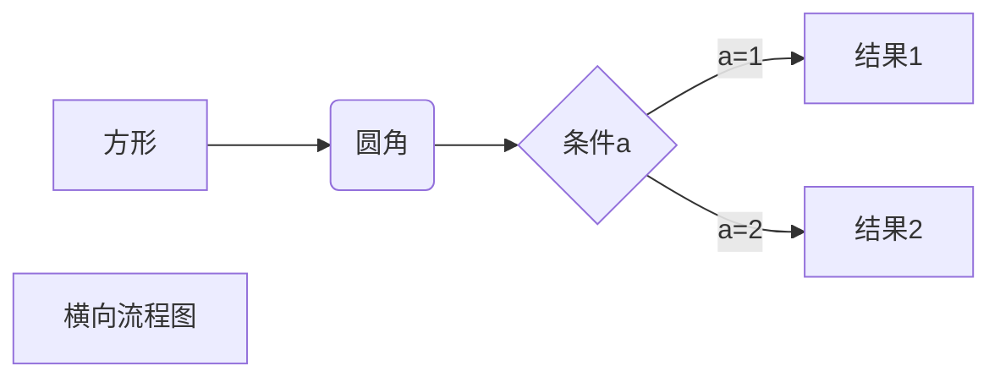
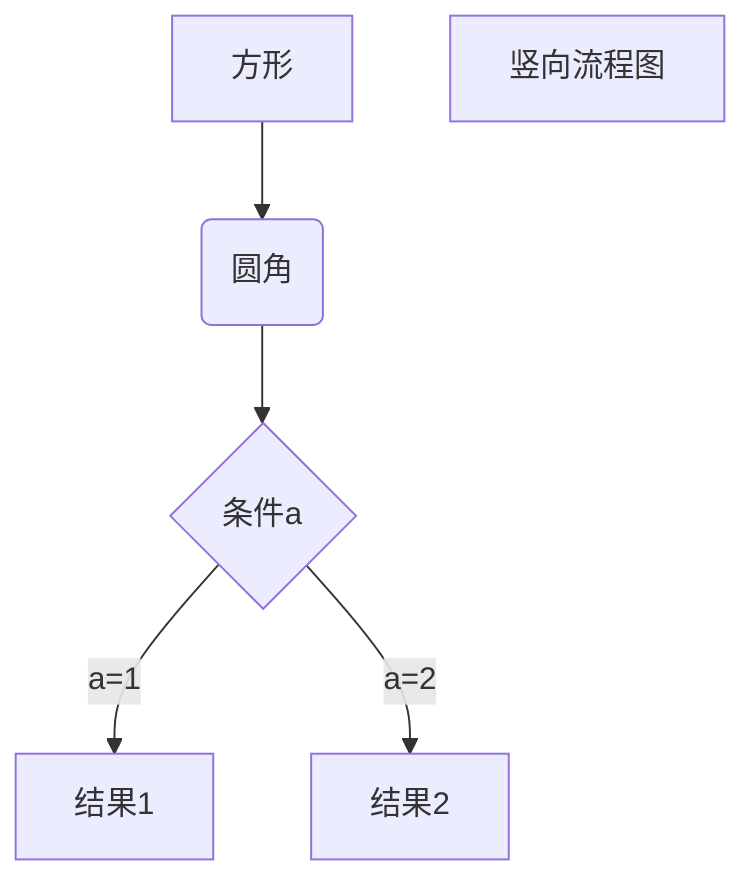
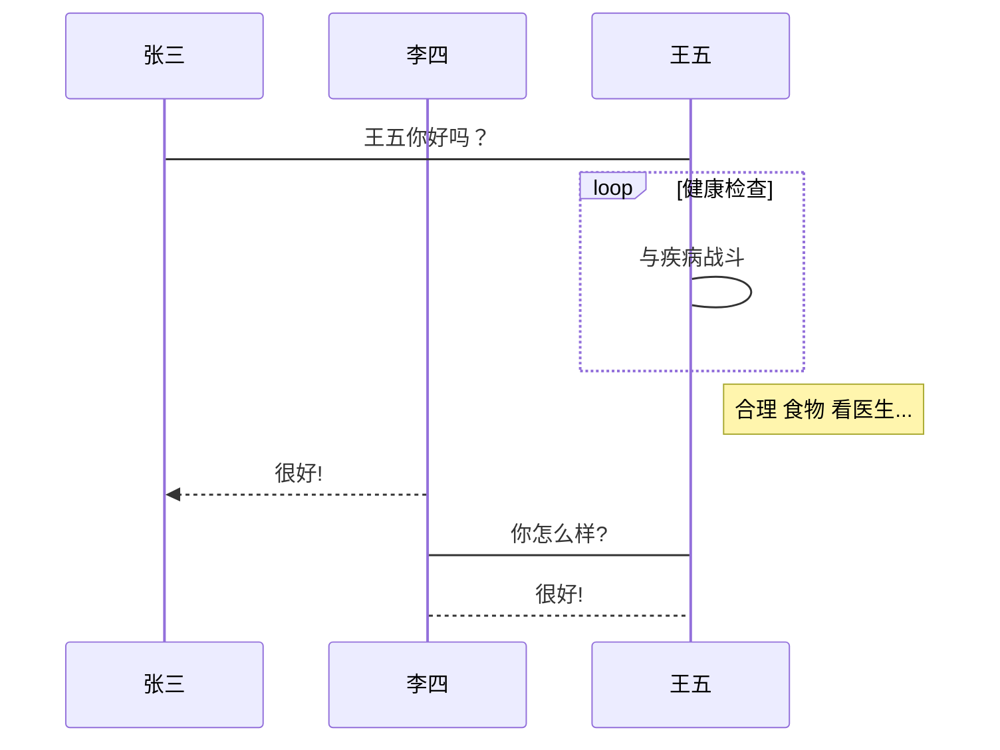
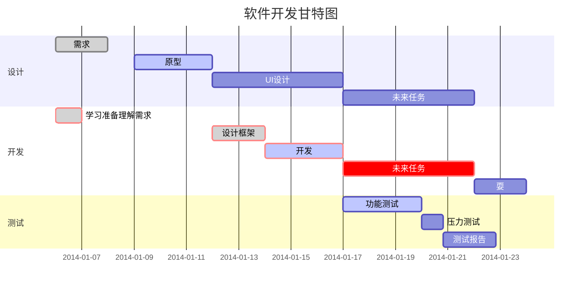

# MarkDown语法

## 标题

|样式	|语法					|
|-		|-						|
|标题一	|# 内容 or 内容换行=	|
|标题二	|## 内容 or 内容换行-	|
|标题三	|### 内容				|
|标题四	|#### 内容				|
|标题五	|##### 内容				|
|标题六	|###### 内容			|

**主流使用#标题写法**
=-标题写法 易与分隔线混淆，只能支持两级标题，支持度低


---


## 字体

- 斜体：	*内容* or _内容_
- 粗体：	**内容** or __内容__
- 粗斜体：	***内容*** or ___内容___
- 删除线：	~~内容~~
- 代码体：	`内容`
- 注释：	<!-- 内容 -->


---


## 段落

1. 段落末尾使用两个以上空格
2. 段落末尾使用一个空行来


---


## 分隔线
 
空行里，使用三个以上的 星号 or 减号 or 下划线
符号间可以有空格，例如 - - -


---


## 列表

无序列表：使用 加号 or 减号 or 星号 作为列表标记

- 第一个元素
- 第二个元素
	换行不加标记，仍停留在当前列表
- 第三个元素
* 更换前缀符号，代表新列表
+ 又换了前缀符号，又一个新列表
+ 上下文同前缀时，视为一个列表

有序列表：使用1. 2. 3. 4. 作为列表标记

1. 第一个元素
	换行不加标记，仍停留在当前列表
2. 第二个元素
3. 第三个元素
4. 第四个元素

无序列表和有序列表可以嵌套
在子列表中的选项前面添加 制表符 或 四个空格

- 1
- 2
	1. 21
	2. 22
	3. 23
		+ 231
		+ 232
		+ 233
	4. 24
- 3
- 4


---


## 链接


链接：[链接文本](跳转URL)
直链：<跳转URL>

变量链接：
[文本][变量]
[变量]: URL


图片：


---


## 块内容

引用块：> 内容

> 引用块
>> 可以多层堆叠
>> 产生缩进的效果
>>> 可以预览来查看效果


代码块：

代码名词或单行代码，使用 反引号 包裹内容
`printf('Demo');`


大块代码，使用```包裹内容，可指定代码语言

```javascript
$(document).ready(function(){
    alert('This is Demo')
});
```

也可以使用制表符或四空格风格，但非常不建议
无着色，而且会破坏代码原先的格式

	$(document).ready(function(){
		alert('This is Demo')
	});


---


## 表格

- 使用 | 来分隔不同的单元格
- 使用 - 来分隔表头和其他行
- 使用 : 来指定对齐方向
- 建议使用制表符进行格式化，让源文件更有可读性

|TH	|TH	|TH		|
|:-	|-:	|:-:	|
|TD	|TD	|TD		|
|TD	|TD	|TD		|


---


## 绘图

- 横向流程图：



---

- 竖向流程图



---

- 标准横向流程图

```flow
st=>start: 开始框
op=>operation: 处理框
cond=>condition: 判断框(是或否?)
sub1=>subroutine: 子流程
io=>inputoutput: 输入输出框
e=>end: 结束框
st(right)->op(right)->cond
cond(yes)->io(bottom)->e
cond(no)->sub1(right)->op
```

---

- 标准竖向流程图

```flow
st=>start: 开始框
op=>operation: 处理框
cond=>condition: 判断框(是或否?)
sub1=>subroutine: 子流程
io=>inputoutput: 输入输出框
e=>end: 结束框
st->op->cond
cond(yes)->io->e
cond(no)->sub1(right)->op
```

---

- UML时序图

```sequence
对象A->对象B: 对象B你好吗?（请求）
Note right of 对象B: 对象B的描述
Note left of 对象A: 对象A的描述(提示)
对象B-->对象A: 我很好(响应)
对象A->对象B: 你真的好吗？
```

---

- UML复杂时序图

```sequence
Title: 标题：复杂使用
对象A->对象B: 对象B你好吗?（请求）
Note right of 对象B: 对象B的描述
Note left of 对象A: 对象A的描述(提示)
对象B-->对象A: 我很好(响应)
对象B->小三: 你好吗
小三-->>对象A: 对象B找我了
对象A->对象B: 你真的好吗？
Note over 小三,对象B: 我们是朋友
participant C
Note right of C: 没人陪我玩
```

---

- UML标准时序图



---

- 甘特图

